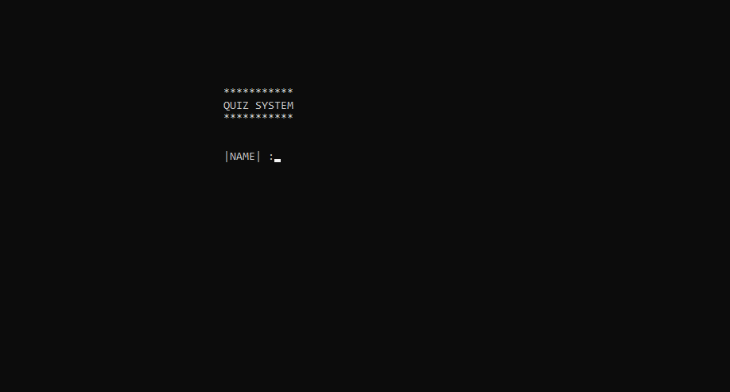
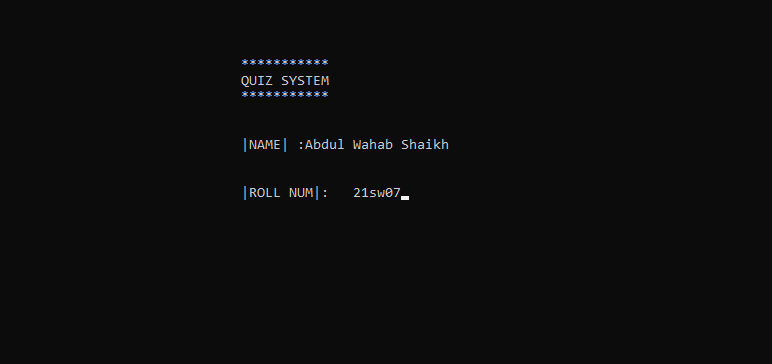
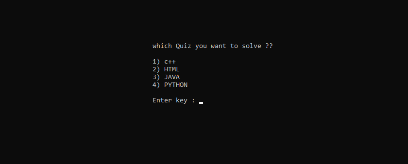
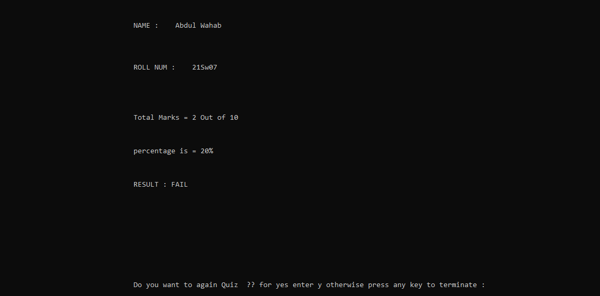
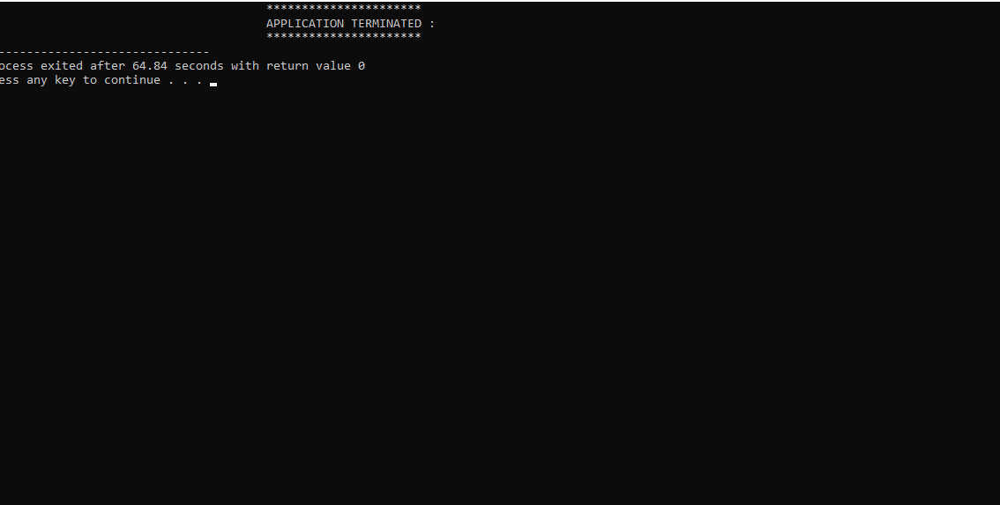

 # _**Quiz System in C++**_

>  **Who Am I ?** :
Hello! this is me ABDUL WAHAB SHAIKH 21SW07  this is my first project of first year in the journey of software enginnering in this project I have made a little quiz system which works perfectly

 ### How IT WORKS?
 > In this system I have included programming languages questions we can say that this system to (programming language QUIZ SYSTEM) in this system four language (MCQS) included  
>1)C++
> 
> 2)java
> 
> 3)PYTHON
> 
> 4)HTML
> 
>  when you open this system It first of all ask your name as well as your roll number after that it will show a screen which quiz you want to solve and it give will you option menu  means to say to it will show to select programming language MCQS
when you click the 1 it will show c++ quiz system or if you click 2 it will show JAVA mcqs or if you will click 3 it will show you PYTHON  (MCQS) or if you click 4 it will show you HTML (MCQS) after click a number from above menu it will show you a screen wait like this  (please wait for few seconds……..)
after that it will allow you to play with (MCQS) when quiz questions complete it will show you your result screen in the result screen it will show you  your name and your roll number moreover your total marks out of 10 and also show you your percentage in the last it will also show you your result status whether you pass or fail……..Most important thing I have worked with file handling ,your all data and ans of your wrong qusetions will be saved in the file you can see your data anytime,
I have done  with different name of file c++ mcqs data will save in the c++ file ,same it for language mcqs

## HOW I HAVE MADE IT ?

> I have made it with  OBJECT ORIENTED PROGRAMMING CONCEPT worked with class and objects, most important thing is that I have devided it with user define header files 
let me explain how ?? as I have create a function  of c++ mcqs so I write it separately in the user define header file and connect it with main cpp file  I have just not write header file for c++ I have create user header files for all language mcqs  which I have included in that system C++ HTML JAVA PYTHON

##  HOW IT LOOKS?

***

***

***

***

## TOTAL LINE OF CODE (LOC) :

>**242 lines of c++ header file
241 lines of HTML header file
243 line of java header file
236 lines of python header file
83 lines of main.CPP**
>>TOTAL :
**1045 (one thousand fourty-five )**

